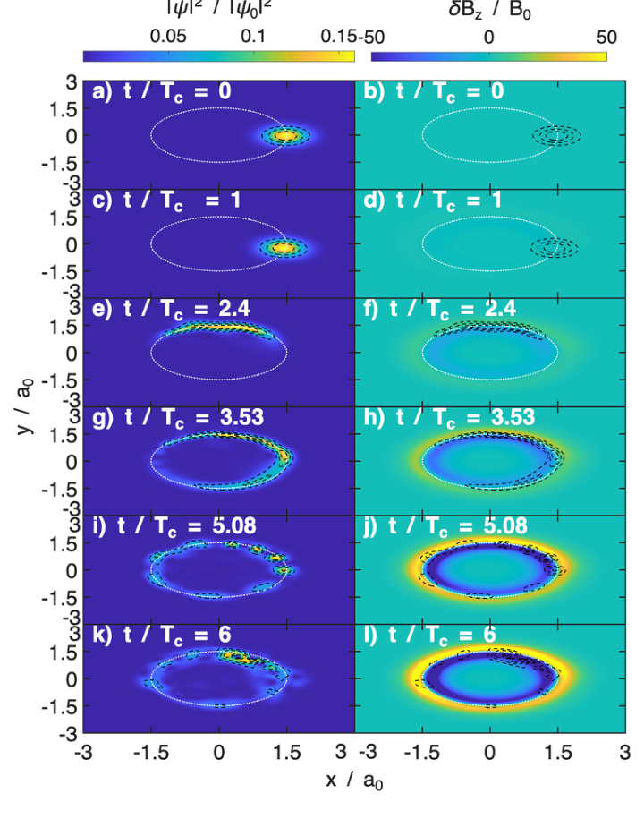

<p align="center">
  
</p>


<p align="center">
  A lightweight, structure-preserving MATLAB and Python platform for general
  coupled Schrödinger–Maxwell simulation, analysis, and algorithm development.
  Periodic boundaries support one, two, and three dimensions; the original
  fixed-boundary operator supports two dimensions.
</p>

SPHINX implements the structure-preserving algorithms developed in our study of
self-consistent electron radiation reaction with the coupled
Schrödinger-Maxwell system. The repository supports both the research examples
from that work and more general user-defined fields, grids, coefficients, and
initial conditions.

## Research context

The coupled system evolves a quantum wavefunction together with its dynamical
electromagnetic field. The numerical maps are constructed to preserve the
geometric structure of the semi-discrete system, including symplecticity and
the unitary quantum evolution associated with the Cayley update. We use operator
splitting to compose the electromagnetic and quantum subflows.

In the published cyclotron examples, a coherent electron state begins in a
uniform magnetic field and evolves self-consistently with the radiation it
produces. SPHINX follows the transfer of energy between the quantum and
electromagnetic subsystems together with the changing probability distribution
and perturbed magnetic field.

<p align="center">
  
</p>

<p align="center"><em>
  Coupled evolution of the coherent-state probability density and perturbed
  magnetic field over six cyclotron periods. Figure 3 of Molina and Qin (2026).
</em></p>

The associated manuscript derives the maps and discusses coherent-state and
Landau-level simulations in detail:

- J. M. Molina and H. Qin, “Self-Consistent Dynamics of Electron Radiation
  Reaction via Structure-Preserving Geometric Algorithms for Coupled
  Schrödinger-Maxwell Systems,” [arXiv:2602.17429](https://arxiv.org/abs/2602.17429)
  (2026).

## Download MATLAB or Python

The [GitHub Releases page](https://github.com/jmmolina113/SPHINX/releases) has
two independent downloads:

- **SPHINX-MATLAB.zip** — unzip, open `START_HERE.m`, and press **Run**.
- **SPHINX-Python.zip** — unzip and open `install_and_run.command` on macOS,
  `install_and_run.sh` on Linux, or `install_and_run.bat` on Windows.

The repository keeps both implementations together so the cross-language
equivalence tests remain reproducible. Each release archive is separate, so
you can download only the one you plan to use.

## Numerical core and editable analysis

SPHINX keeps the numerical core separate from analysis and problem setup. Users
can adapt analysis scripts, plots, initial conditions, parameters, and
post-production without changing the solver itself.

For reproducibility, each run compares the numerical files with
`SPHINX_CORE_MANIFEST.json` and records `SPHINX-CERTIFIED`,
`SPHINX-MODIFIED`, or `SPHINX-UNVERIFIED` in its result. These labels make it
easy to distinguish the distributed solver from a locally modified version.
See [the name and provenance policy](TRADEMARKS.md).

SPHINX is distributed under the [Apache License 2.0](LICENSE). The license
permits use, study, modification, and redistribution. The accompanying
provenance policy explains how the SPHINX name is used for modified versions.

## Run SPHINX in sixty seconds

SPHINX is validated with MATLAB R2025b. Clone or download the repository, make
it the current MATLAB folder, and run:

```matlab
setupSPHINX
SPHINX_demo
```

The demo runs a small 2D example, imports the saved fields, computes
probability and Hamiltonian diagnostics, and writes a diagnostic CSV under
`output/`. Figures and movies can then be selected from the post-production
options.

Nothing is installed globally, and there are no absolute paths to edit.

## Configure your own simulation

The plain-language interface is the easiest place to start. The bundled
`cyclotron` preset provides one example problem:

```matlab
sim = sphinx.configure("cyclotron", ...
    "Resolution","quick", ...
    "Model","both", ...
    "Boundary","fixed", ...
    "RunName","my_first_run");

sphinx.describe(sim);
sphinx.preview(sim);
result = sphinx.run(sim);
```

To materialize and display the initialized fields before running:

```matlab
report = sphinx.preview(sim,"ShowFields",true);
```

The field preview uses line plots in 1D, planar maps in 2D, and orthogonal
center slices in 3D. The default preview does not allocate the simulation.

Inspect every supported choice with:

```matlab
sphinx.options
```

Available resolution profiles are `quick`, `standard`, `original`, and
`3d_demo`. Available evolution modes are electromagnetic-only (`EM`),
quantum-only (`QM`), and the coupled system (`both`). Fixed boundaries use the
original 2D operator; periodic boundaries support 1D, 2D, and full 3D runs.

The numerical core works with user-supplied wavefunctions, vector potentials,
canonical electromagnetic momenta, scalar potentials, grids, and physical
coefficients. New initializers and named problem presets can be added on top of
the same structure-preserving maps without changing the solver underneath.

If you prefer a form with one clearly marked edit block, use
[`examples/advisor_simulation_setup.m`](examples/advisor_simulation_setup.m).

## Analyze a completed run

Post-production is divided into import, analysis, and product selection:

```matlab
data = sphinx.post.importRun(result);
analysis = sphinx.post.analyze(data);

files = sphinx.post.produce(data,analysis, ...
    ["summary","conservation","snapshot"]);
```

The importer reconstructs the wavefunction, vector and electric potentials,
electromagnetic fields, currents, canonical momentum, and Poynting flux. It
also checks the solver's full-3D flattening convention before analysis.

```matlab
sphinx.post.options
```

lists the available diagnostics, fields, figures, movies, tables, and workspace
outputs. The editable post-production form lives at
[`examples/advisor_postproduction.m`](examples/advisor_postproduction.m).

## What is included

| Path | Purpose |
|---|---|
| [`+sphinx/`](+sphinx) | Public simulation API |
| [`+sphinx/+post/`](+sphinx/+post) | Supported post-production API |
| [`matlabSolver/`](matlabSolver) | Numerical operators and split Hamiltonian maps |
| [`examples/`](examples) | Runnable demonstrations and editable setup forms |
| [`tests/`](tests) | 2D/3D API, equivalence, ordering, and analysis tests |
| [`docs/`](docs) | User, numerical, architectural, and output documentation |
| [`assets/`](assets) | SPHINX artwork and project-related publication figures |

## Numerical and output contract

SPHINX advances the electromagnetic and quantum Hamiltonian maps with rolling
state buffers instead of allocating the full time history. The solver reports
each iterative-solver flag, residual, and iteration count.

Each run receives a timestamped folder containing:

```text
manifest.json
result.json
S/
F/
V/
```

The manifest records the complete problem definition, MATLAB version, source
revision, timestamps, storage preview, completion status, and solver diagnostics.
Imported field histories use `[time,y,x,z]`; flat solver fields use `x` fastest,
then `y`, then `z`, with vector components stored contiguously.

## Validate your checkout

Run the public test suite from MATLAB:

```matlab
addpath('tests')
SPHINX_configuration_options_test
SPHINX_user_api_test
SPHINX_V_full_integration_test
SPHINX_postproduction_test
```

The numerical integration test compares the rolling solver with preserved
reference maps for fixed 2D and periodic 3D runs in `EM`, `QM`, and `both`
modes. The post-production test uses a nonsquare `5 × 4 × 3` grid to exercise
the axis-order convention directly.

## Documentation

- [Documentation index](docs/README.md)
- [First-run user guide](docs/USER_GUIDE.md)
- [Simulation options](docs/SIMULATION_OPTIONS.md)
- [Post-production guide](docs/POST_PRODUCTION.md)
- [Theory and algorithms](docs/THEORY_AND_ALGORITHMS.md)
- [Numerical solver](docs/NUMERICAL_SOLVER.md)
- [Architecture](docs/ARCHITECTURE.md)
- [Known issues and scientific qualifications](docs/KNOWN_ISSUES.md)
- [Python implementation](python/README.md)
- [Download packaging](distribution/README.md)

For low-level research access, `sphinx.prepare` exposes the initialized fields,
coordinates, and normalized solver parameters without advancing the system.
This public distribution contains the supported API and selected examples;
historical run scripts and experiment-specific analysis are intentionally left
out. For new work, start with the `sphinx` and `sphinx.post` interfaces.

The publication figure above is reproduced from the project manuscript under
its arXiv distribution license.
